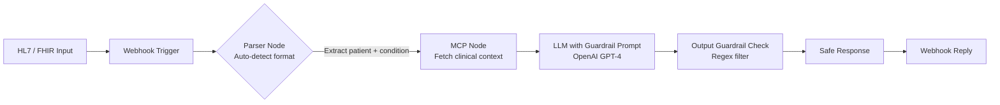

# n8n Healthcare LLM Workflow – HL7/FHIR with Guardrails & MCP

[](https://opensource.org/licenses/MIT)
[](https://n8n.io)
[](https://openai.com)
[](https://www.hl7.org)
[](https://hl7.org/fhir)

**A ready-to-import n8n automation workflow that safely ingests HL7 v2.x and FHIR R4 data, enforces strict LLM guardrails, and integrates with Model Context Protocol (MCP) for clinically responsible AI responses.**

> 🏥 **Purpose:** Enable secure, auditable LLM-assisted decision support without allowing the model to diagnose, prescribe, or guarantee outcomes.

---

## ✨ Features

| Feature | Description |
|---|---|
| **Auto-detect HL7 / FHIR** | Accepts raw HL7 pipe-separated strings or FHIR JSON resources/bundles |
| **Smart Extraction** | Pulls patient ID, condition/problem, and clinical context from both formats |
| **MCP Integration** | Calls your Model Context Protocol server to inject evidence-based guidelines |
| **LLM with Hard Guardrails** | System prompt enforces safety rules (no diagnoses, no prescriptions, always recommend physician consultation) |
| **Post-processing Guardrail** | Regex-based filter blocks forbidden patterns (e.g. `guarantee`, `prescribe`, `100% cure`) |
| **Webhook Ready** | Easy to call from any EMR, API gateway, or external system |
| **Fully Customizable** | Modify Code nodes, swap the LLM provider, or add your own clinical rules |

---

## 🧱 Architecture



---

## ⚙️ Installation & Setup

### 1. Import the Workflow into n8n

1. Download `workflow.json` from this repository.
2. In n8n, go to:

   `Workflows → Add Workflow → Import from File`

3. Upload `workflow.json`.

---

### 2. Configure LLM Credentials

1. Open the **LLM with Guardrail Prompt** node.
2. Under **Credentials**, select or create your OpenAI API credential.
3. (Optional) If using another LLM provider, replace the node with an equivalent HTTP Request node.

---

### 3. Configure the MCP Endpoint

1. Open the **MCP - Model Context Protocol** node.
2. Replace the `url` field with your MCP server endpoint:

```txt
https://your-mcp.internal/clinical-context
```

3. Ensure the node sends the required payload:

- `patientId`
- `clinicalContext`

The workflow already injects:

```js
{{ $json.patientId }}
{{ $json.clinicalContext }}
```

---

## 🧪 Example Requests

### Example 1 – HL7 v2.x Message

```bash
curl -X POST https://your-n8n.com/webhook/health-llm-guardrail \
  -H "Content-Type: text/plain" \
  -d 'MSH|^~\&|SendingApp|SendingFac|||202501231200||ADT^A01|MSGID|P|2.5
PID|||P12345||Doe^John||19800101|M
OBX|1|TX|CONDITION||Diabetes Type 2 with neuropathy'
```

---

### Example 2 – FHIR Condition Resource

```bash
curl -X POST https://your-n8n.com/webhook/health-llm-guardrail \
  -H "Content-Type: application/json" \
  -d '{
    "resourceType": "Condition",
    "id": "cond-567",
    "subject": {
      "reference": "Patient/67890"
    },
    "code": {
      "text": "Uncontrolled hypertension, stage 2"
    }
  }'
```

---

## ✅ Example Response (Guardrail-Compliant)

```json
{
  "originalLlmResponse": "Based on the provided information about uncontrolled hypertension, I recommend consulting a licensed physician for a complete treatment plan...",
  "guardrailPassed": true,
  "finalResponse": "Based on the provided information about uncontrolled hypertension, I recommend consulting a licensed physician for a complete treatment plan...",
  "violationsDetected": []
}
```

---

## 🛡️ Guardrails – How the Workflow Stays Safe

| Layer | Mechanism |
|---|---|
| **1. System Prompt** | Explicitly forbids diagnoses, treatment plans, guarantees, and prescriptions. Always recommends physician consultation. |
| **2. Output Regex Filter** | Scans for patterns like `/guarantee/i`, `/prescribe/i`, `/100% cure/i`. If matched, the response is replaced with a safety message. |
| **3. MCP Context Injection** | Guides the LLM with evidence-based constraints from your own clinical server. |

You can extend the regex patterns in the **Output Guardrail Check** node by editing the `forbiddenPatterns` array.

---

## 🔧 Customization Ideas

- Swap OpenAI with Anthropic, Azure OpenAI, Gemini, or local LLMs
- Add PHI redaction before sending prompts
- Store audit logs in PostgreSQL or Elasticsearch
- Add clinician approval workflows
- Integrate with Epic, Cerner, or SMART on FHIR APIs
- Add RAG retrieval from internal medical guidelines

---

## 📌 Notes

- This workflow is intended for **decision support**, not autonomous clinical diagnosis.
- Always validate outputs with licensed healthcare professionals.
- Ensure compliance with HIPAA, GDPR, and your organization's security requirements before production deployment.

---

## 📄 License

This project is licensed under the MIT License.
